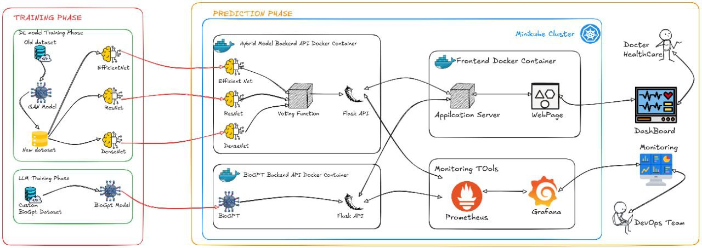

# Hybrid Model Based Lung Cancer Prediction using Histopathology Images

Hybrid Model Based Lung Cancer Prediction – Deployed deep learning models (EfficientNet, ResNet, DenseNet, BioGPT) on Minikube using Docker, with system monitoring via Prometheus and Grafana for scalable and observable AI-driven cancer prediction.
